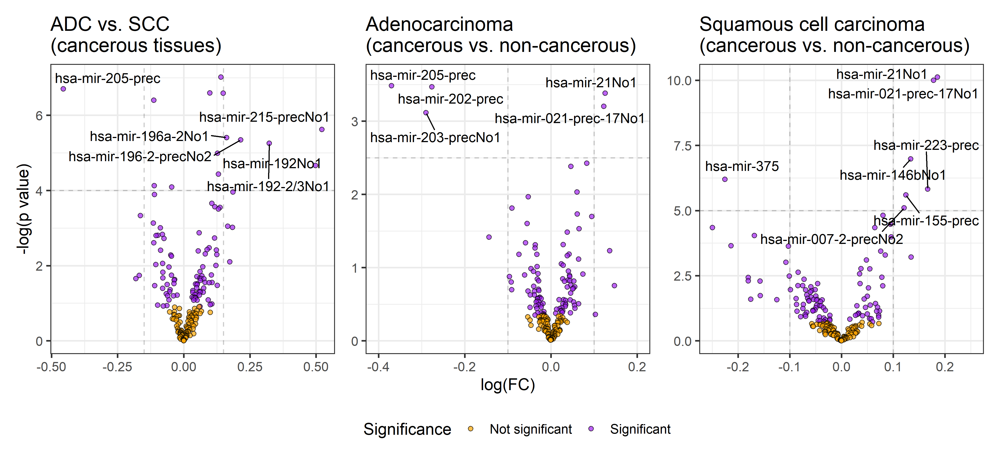
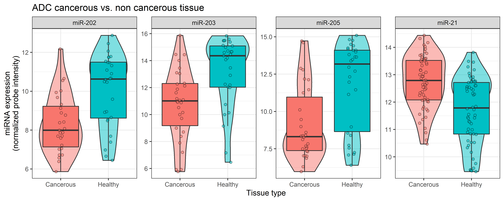
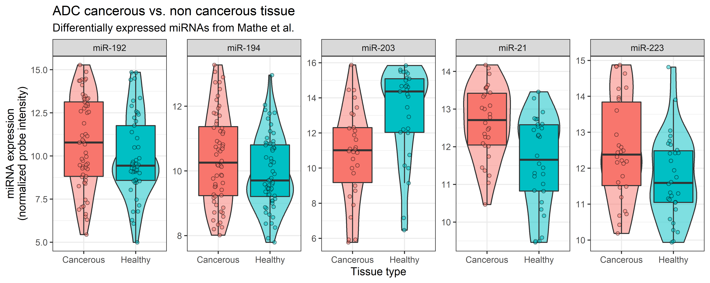

```{r, include = FALSE}
knitr::opts_chunk$set(
  collapse = TRUE,
  comment = "#>",
  fig.path = "man/figures/README-",
  out.width = "100%"
)
```

# Group 11 Final project 2022

Final project for the 22100 R for Bio Data Science course at DTU. The project has been carried out by:

- Dalsberg Jørgensen, Jonas - s213551 
- Gutierrez Leon, Alvaro - s212714 
- Hoang Viet Minh Pham, Jake - s213060 
- Romero Yianni, Daniel - s220260 


## Introduction

## Data

The dataset used in the projects consists of miRNA expression data for 76 esophageal cancer patients from the US and Japan. It was generated and published by [Mathé *et al.*](https://pubmed.ncbi.nlm.nih.gov/19789312/) and we retreived it from the [GEO website](https://www.ncbi.nlm.nih.gov/geo/query/acc.cgi?acc=GSE13937).

## Objectives

Here we aim to reproduce the findings of the authors and elaborate on their visualizations.

## Pipeline

The data processing pipeline is summarised in the flowchart:  
  
```{r, echo=FALSE}
knitr::include_graphics("doc/flowchart.png")
```

## Results

### Survival

### PCA

### Differential expression

Even though we followed the steps described by Mathé *et al.*, we have found many more differentially expressed miRNAs when fitlering with the same criteria. By plotting the differentially expressed miRNAs, we corroborate that the miRNAs that we have found are, in fact, *more* differentially expressed than the ones found by Mathé *et al.*.  
```{r, echo=FALSE}

```

```{r, echo=FALSE}

```

```{r, echo=FALSE, out.width = "500px"}
knitr::include_graphics("results/ADC_SCC_diffexp_plot_paper.png")
```

```{r, echo=FALSE}

```

```{r, echo=FALSE}

```

```{r, echo=FALSE}
knitr::include_graphics("results/SCC_CT_NCT_diffexp_plot.png")
```

```{r, echo=FALSE, out.width = "500px"}

```
