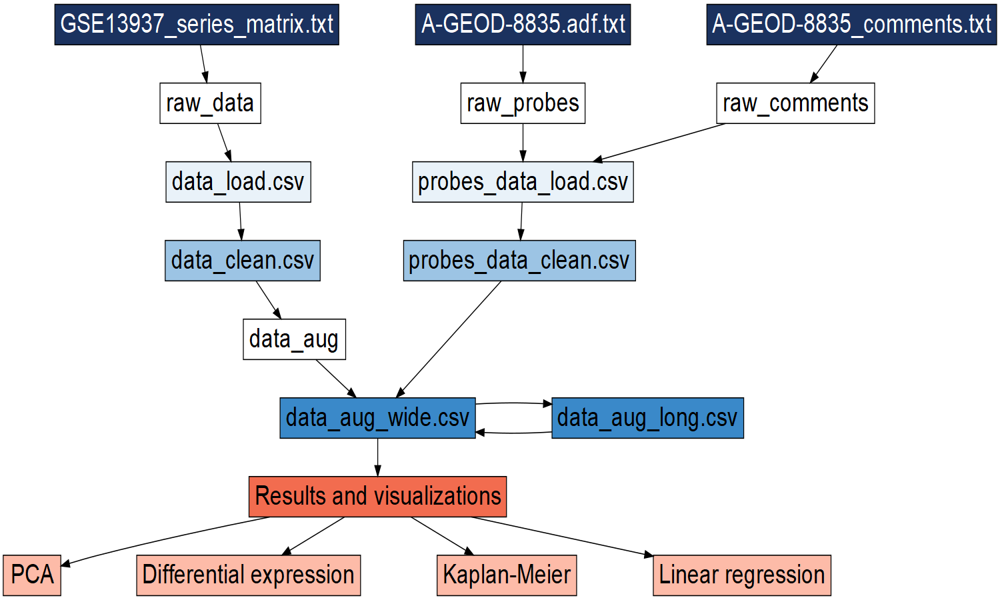
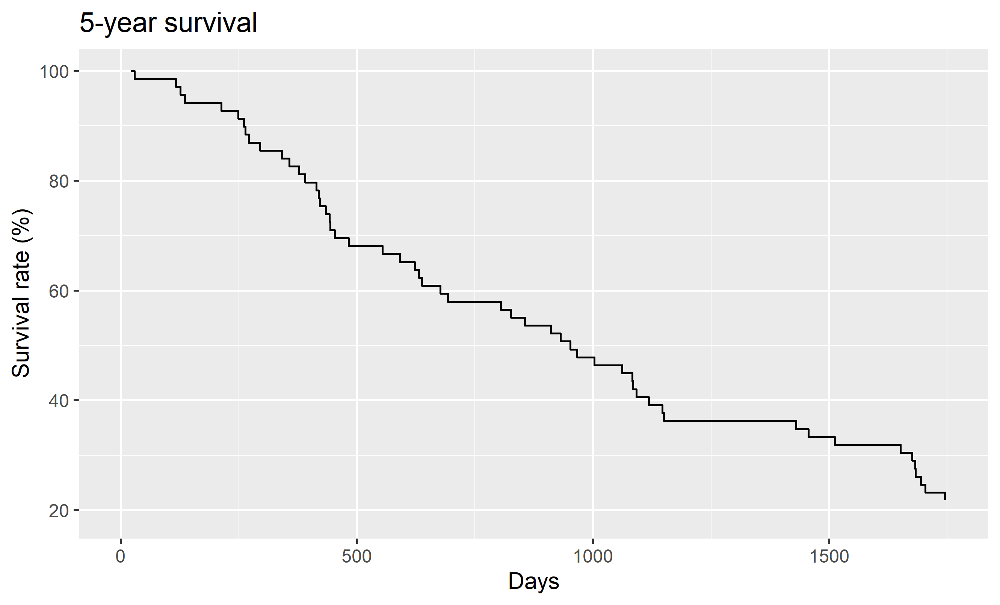
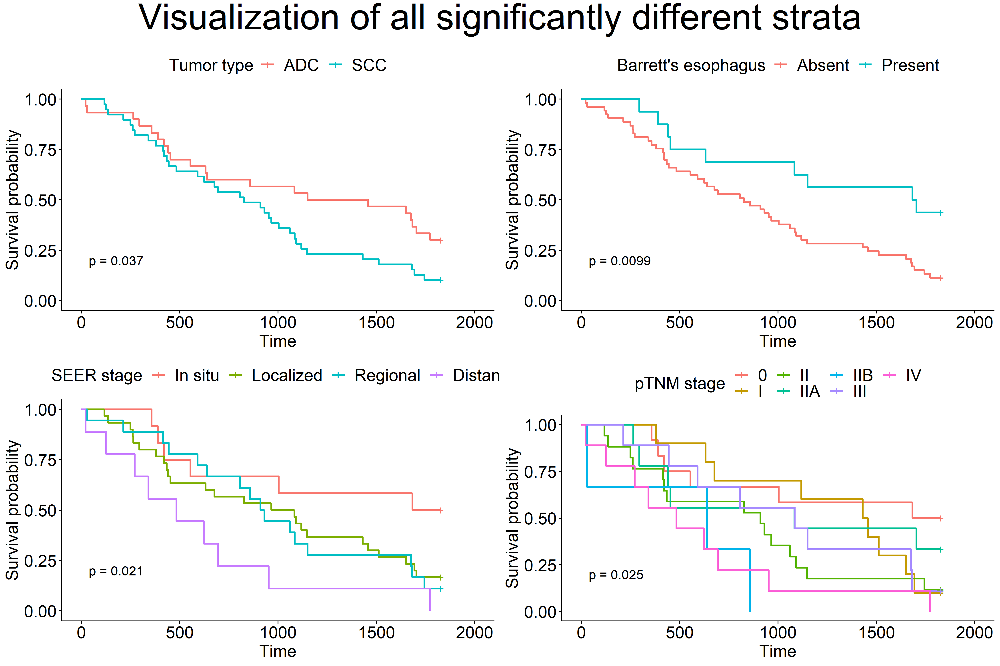
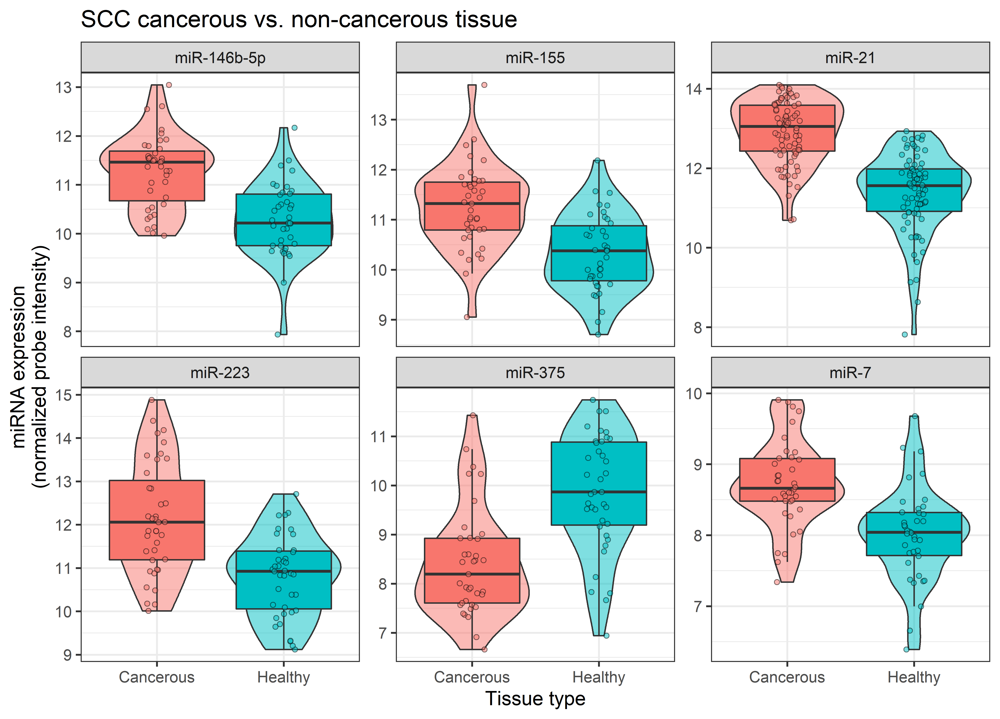

```{r, include = FALSE}
knitr::opts_chunk$set(
  collapse = TRUE,
  comment = "#>",
  fig.path = "man/figures/README-",
  out.width = "100%"
)
```

# Group 11 Final project 2022

Final project for the 22100 R for Bio Data Science course at DTU. The project has been carried out by:

- Dalsberg Jørgensen, Jonas - s213551 
- Gutierrez Leon, Alvaro - s212714 
- Hoang Viet Minh Pham, Jake - s213060 
- Romero Yianni, Daniel - s220260 


## Introduction

## Data

The dataset used in the projects consists of miRNA expression data for 76 esophageal cancer patients from the US and Japan. It was generated and published by [Mathé *et al.*](https://pubmed.ncbi.nlm.nih.gov/19789312/) and we retrieved it from the [GEO website](https://www.ncbi.nlm.nih.gov/geo/query/acc.cgi?acc=GSE13937).

## Objectives

Here we aim to reproduce the findings of the authors and elaborate on their visualizations.

## Pipeline

The data processing pipeline is summarised in the flowchart:  
  
```{r, echo=FALSE}

```

## Results

### Survival
We first produced an initial Kaplan-Meier curve for all of our samples as a test.
```{r, echo=FALSE}

```

We then looked into different strata and checked for signifiance.
The four significant strata were plotted. There is a strong resemblance between
the two top plots (tumor types and Barrett's esophagus(BE)). This may be because the
majority of patients with ADC present with Barrett's esophagus, and no SCC 
patients have it. Hence, using BE as strata essentially splits the data into
SCC patients + a few ADC patients without BE versus ADC patients with BE.
The pTNM stage plot was difficult to look at due to the many strata.
The SEER stages are clearly separated, except for localized and regional.
While fewer patients initially presenting with regional stage cancer are alive
after 5 years than the patients who presented with localized stage cancer, it
is not a very convincing visual result.
```{r, echo=FALSE}

```

For the aforementioned reasons, we opted to plot the two best options from the
previous plot. We included a bar plot with patient group counts at the top to 
better be able to assess the credibility of the results.
```{r, echo=FALSE}
knitr::include_graphics("results/kaplan_meier_tumo_seer.png")
```

An initial but discarded idea was to present just the SEER stage plots. In this
version, we have included a bar plot with the 5-year survival rates (top right).
```{r, echo=FALSE}
knitr::include_graphics("results/kaplan_meier_seer.png.png")
```

When exploring different strata, it initially seemed like the country (cohort)
was a promising indicator of outcome, as patients from the US survived
significantly longer than patients from Japan (p-value = 0.02) (left plot).
However, looking into the metadata we realized that the Japanese samples only
contain SCC specimen, and so the plot on the left essentially separated the
patients based on two conditions - country and tumor type (SCC vs. ADC+SCC).
As we have shown in kaplan_meier_all.png and kaplan_meier_tumo_seer.png,
tumor type seems to be a good indicator of outcome, and so it is not surprising
that US patients survive longer than Japanese patients (ADC > SCC).
We then filtered for only SCC samples to more fairly compare the countries,
and we found a p-value of 0.31, so the observed difference in outcome was not
significant.
```{r, echo=FALSE}
knitr::include_graphics("results/kaplan_meier_us_jap.png")
```

### PCA

### Differential expression

Even though we followed the steps described by Mathé *et al.*, we have found many more differentially expressed miRNAs when filtering with the same criteria. By plotting the differentially expressed miRNAs, we corroborate that the miRNAs that we have found are, in fact, *more* differentially expressed than the ones found by Mathé *et al.*.  
```{r, echo=FALSE}
knitr::include_graphics("results/presentation_vplots.png")
```

```{r, echo=FALSE}
knitr::include_graphics("results/ADC_SCC_diffexp_plot.png")
```

```{r, echo=FALSE, out.width = "500px"}
knitr::include_graphics("results/ADC_SCC_diffexp_plot_paper.png")
```

```{r, echo=FALSE}
knitr::include_graphics("results/ADC_CT_NCT_diffexp_plot.png")
```

```{r, echo=FALSE}
knitr::include_graphics("results/ADC_CT_NCT_diffexp_plot_paper.png")
```

```{r, echo=FALSE}

```

```{r, echo=FALSE, out.width = "500px"}
knitr::include_graphics("results/SCC_CT_NCT_diffexp_plot_paper.png")
```
