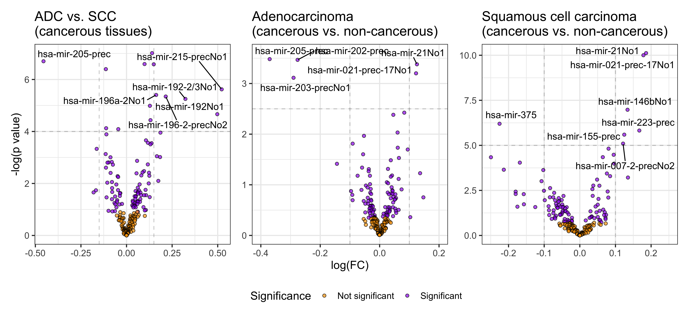

<!-- Change the text to black but does not work properly -->
<!-- <style type="text/css"> -->
<!-- body p { -->
<!--   color: #000000; -->
<!-- } -->
<!-- </style> -->

<!-- This allows to change color of text individually  -->
<!-- - <span style="color:red">**Source of the dataset:** MiRNA expression in squamous cell carcinoma and adenocarcinoma of the esophagus and associations with survival.</span> -->
<!-- <br> -->
```{r setup, include=FALSE}
knitr::opts_chunk$set(echo = FALSE)
library(DiagrammeR)
```


## Introduction {data-background=#FFFFFF}
- **Source of the dataset:** MiRNA expression in squamous cell carcinoma and adenocarcinoma of the esophagus and associations with survival.

    - Microarray data from cancerous and adjacent noncancerous tissues collected from 100 adenocarcinoma and 70 SCC patients enrolled at four clinical centers from the United States, Canada, and Japan


- **Objective of the project:** To reproduce the findings of the authors and elaborate on their visualizations.

## Materials and methods | Patient data: {data-background=#FFFFFF}
- **GSE13937_series_matrix.txt**
<br>

- National Center for Biotechnology Information website   (https://www.ncbi.nlm.nih.gov/geo/query/acc.cgi?acc=GSE13937)

<br>

### Microarray information:
- **A-GEOD-8835.adf.txt** and **A-GEOD-8835_comments.txt** 

- European Bioinformatics Institute website (https://www.ebi.ac.uk/arrayexpress/arrays/A-GEOD-8835/)  


## Materials and methods | Flowchart of the development process {data-background=#FFFFFF}

```{r}
grViz("
digraph flowchart {

  # a 'graph' statement
  graph [overlap = true, fontsize = 10]


  ####### ####### ####### ####### ####### ####### NODES  ####### ####### ####### #######
  ####### RAW 'NODE' STATEMENTS ####### DB5353
  node [shape = box,
        fontname = Helvetica,
        fillcolor = '#1B325F',
        style = filled,
        fontcolor = white]
  'GSE13937_series_matrix.txt'; 'A-GEOD-8835.adf.txt'; 'A-GEOD-8835_comments.txt';
  
  
  ####### LOAD 'NODE' STATEMENTS  #######
  #CSV #FFF6CD
  node [shape = box,
        fontname = Helvetica,
        fillcolor = '#E9F2F9', 
        style = filled,
        fontcolor = black]
  
  'data_load.csv' 'probes_data_load.csv'
  
  #NO CSV
   node [shape = box,
        fontname = Helvetica,
        fillcolor = white,
        style = filled]
  
  raw_data ; 'raw_probes'; 'raw_comments'; 
  
  
  
  ####### CLEAN 'NODE' STATEMENTS  #######
  node [shape = box,
        fontname = Helvetica,
        fillcolor = '#9CC4E4',
        style = filled]
  
  'data_clean.csv' 
  'probes_data_clean.csv'
  
  ######## AUGMENT 'NODE' STATEMENTS  #######
  #CSV
  node [shape = box,
        fontname = Helvetica,
        fillcolor = '#3A89C9',
        stile = filled]
  
  'data_aug_wide.csv'
  'data_aug_long.csv'
  
  #NO CSV
  node [shape = box,
        fontname = Helvetica,
        fillcolor = white,
        style = filled]
  data_aug
  
  ######## RESULTS NODE  #######
  node [shape = box,
        fontname = Helvetica,
        style = filled, 
        fillcolor='#FDBBA8']
  'Results and visualizations' [fillcolor = '#F26C4F']
  
  'PCA'; 'Differential expression'; 'Kaplan-Meier'; 'Linear regression'
  
  
   
   ####### ####### ############### 'EDGE' STATEMENTS  ####### ####### ####### #######
  #Raw - load
  'GSE13937_series_matrix.txt' -> raw_data [label='', fontsize=15, fontname = Helvetica, fontcolor='#131A37']
  
  raw_data -> 'data_load.csv' [color='#131A37']
  'A-GEOD-8835.adf.txt' -> 'raw_probes' 
  'A-GEOD-8835_comments.txt' -> 'raw_comments'
  {'raw_probes' 'raw_comments'} -> 'probes_data_load.csv'
  
  #Load - clean
  'data_load.csv' -> 'data_clean.csv'
  'probes_data_load.csv' -> 'probes_data_clean.csv'
  
  #Clean - augmented
  'data_clean.csv' -> data_aug
  {data_aug 'probes_data_clean.csv'} -> 'data_aug_wide.csv'
  'data_aug_long.csv' -> 'data_aug_wide.csv'
  'data_aug_wide.csv' -> 'data_aug_long.csv'


 #Augmented - Visualizations 
{'data_aug_wide.csv'} -> 'Results and visualizations' -> {'PCA' 'Differential expression' 'Kaplan-Meier' 'Linear regression'} 


  
{ rank = same; 'GSE13937_series_matrix.txt'; 'A-GEOD-8835.adf.txt'; 'A-GEOD-8835_comments.txt' }
{ rank = same; 'data_clean.csv'; 'probes_data_clean.csv' }
{ rank = same; 'data_aug_wide.csv'; 'data_aug_long.csv' }

}
")

```


## Results
```{r cars, echo = TRUE}
summary(cars)
```

## Results
```{r, out.width = "950px"}

```

## Results

## Results

## Discussion
```{r pressure}
plot(pressure)
```

## Discussion
