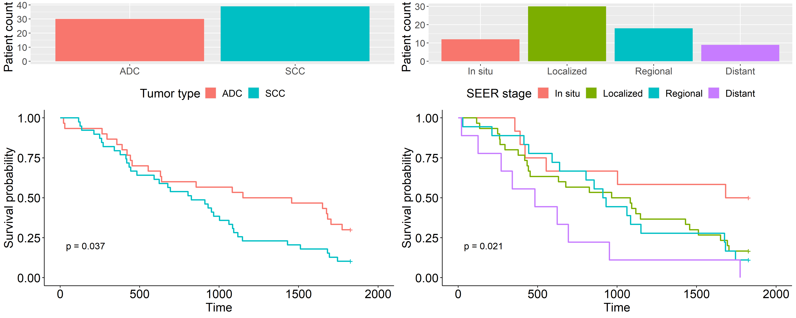
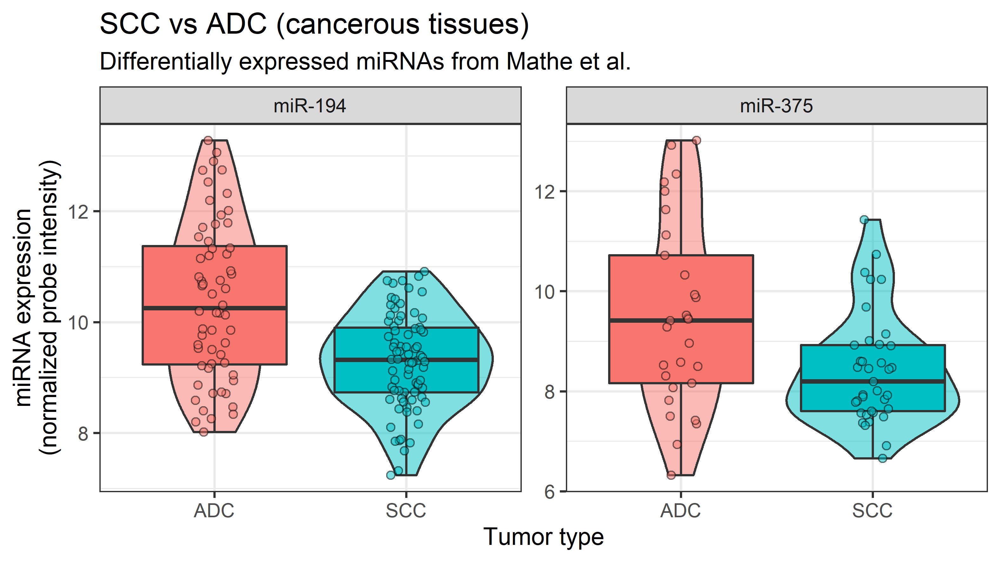

```{r setup, include=FALSE}
knitr::opts_chunk$set(echo = FALSE)
library("tidyverse")
library("ggrepel")
```


## Introduction {data-background=#FFFFFF}
- **Dataset:** MiRNA expression in squamous cell carcinoma and adenocarcinoma of the esophagus and associations with survival.

    - Cancerous and  noncancerous tissues.
    - Cancer stages.
    - 100 ADC and 70 SCC patients.
    - North American and Japanese cohorts.
    - Other variables (tabacco, alcohol)
     

<br>


- **Objective of the project:** To reproduce the findings of the authors and elaborate on their visualizations.


## Materials and methods {data-background=#FFFFFF}
### **Patient data**: 
- **GSE13937_series_matrix.txt**
<br>

- National Center for Biotechnology Information website   (https://www.ncbi.nlm.nih.gov/geo/query/acc.cgi?acc=GSE13937)

<br>

### **Microarray information**:
- **A-GEOD-8835.adf.txt** and **A-GEOD-8835_comments.txt** 

- European Bioinformatics Institute website (https://www.ebi.ac.uk/arrayexpress/arrays/A-GEOD-8835/)  


## Materials and methods | **Flowchart of the data wrangling and analysis** {data-background=#FFFFFF}

<center>
```{r} 
knitr::include_graphics("./images/flowchart.png") 
``` 
</center>


## Results {data-background=#FFFFFF}
```{r, out.width = "1000px", out.height = "500px"}

```

## Results {data-background=#FFFFFF}
```{r, out.width = "950px"}
knitr::include_graphics("../results/presentation_vplots.png")
```

## Results {data-background=#FFFFFF}
```{r, out.width = "950px"}
knitr::include_graphics("../results/ADC_SCC_diffexp_plot.png")
```

## Results {data-background=#FFFFFF}
```{r, out.width = "700px", fig.align = "center"}

```

## Results {data-background=#FFFFFF}
```{r, out.width = "1000px", out.height = "500px"}
knitr::include_graphics("../results/PCA2.png")
```

## Discussion {data-background=#FFFFFF}

- **Data quality:** absence of the different North American cohorts hindered the
reproducibility of the article.

-**Data wrangling:** complex data set which required decision-making regarding the selection of relevant probes, NA values, and others. 

- **Survival:** 

- **Differential expression:** 

- **Principal Component Analysis:** 